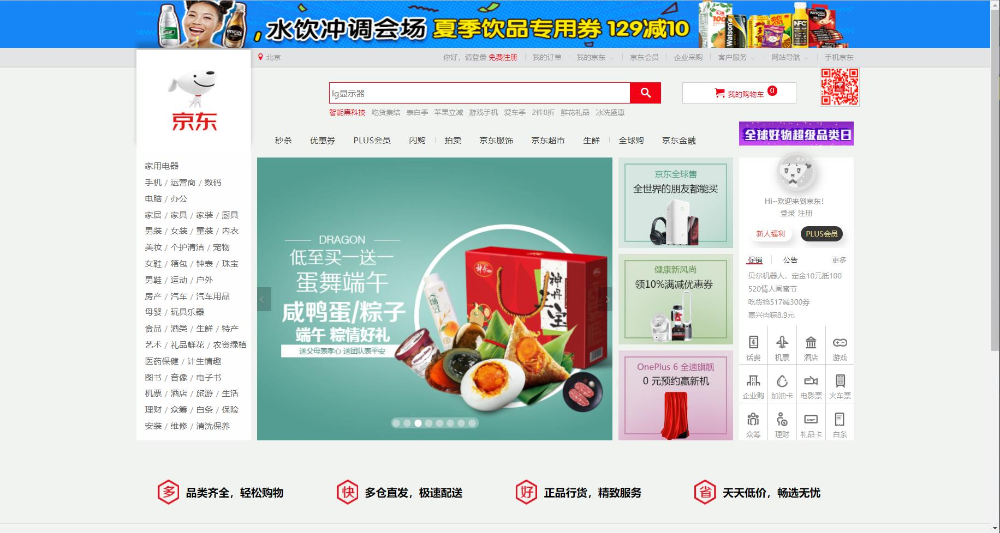

## 仿京东静态首页

### 效果图

## SEO 优化

### 网页 title 标题

title 具有不可替代性，是搜索引擎了解网页的入口，和对网页主题归属的最佳判断点。

#### 标题的长度

- Google，35 个中文
- 百度 28 个中文

#### 关键字分布

- 最先出现的词语权重越高

#### 关键词词频

- 主关键字出现 3 次

- 辅关键字出现 1 次

**建议** ： 首页标题：网站名(产品名)-网站的介绍

### Description 网站说明

1. 同样遵循简短原则 字数含空格在内不要超过 120 个汉字

### Keywords 关键字

1. 应该限制在 6~8 个关键词左右

## 流程

### 确定版心宽度

### 头部

1. 首先制作一个通栏带背景的盒子，确定高度。

2. 嵌套一个盒子，使用版心的宽度，并且水平居中对齐。

3. 插入一个可连接的图片，由于没有指定高度，故其父级元素的高度由图片撑出。

### 快速导航栏

1. 制作一个通栏 div 盒子 测量背景色 高度 border

2. 在通栏盒子里嵌套一个版心样式的 div

3. 在 div 里继续嵌套一个左浮动的 ul 和右浮动的 ul 仿照网站输入文字

4. 设置导航栏右侧小竖线样式 a 链接样式 以及 a:hover 样式

5. 下载 icomoon 图标 声明字体 调用字体 更改颜色

### 手机京东部分

1. 插入二维码图片

2. 解决图片掉下来问题——子绝父相 以及一些微调

### 中间部分

1. 分析结构——6 个盒子组成

#### logo 部分

1. logo 使用 h1 用于提高权重，便于搜索引擎优化

2. 清除 h1 边距

3. 子绝父相 logo 顶上去

4. 增加阴影效果

#### 搜索框部分

1. 确定搜索框部分大小

2. 使用绝对定位

3. 搜索框下面嵌入一个 input 和一个 button 左浮动 清除内外边距

#### 购物车部分

1. 准备 div 盒子，测量大小。绝对定位。

2. 添加 ico 小购物车图标，设定 margin-right

3. 添加 span 盒子放“0”

#### 关键词模块

1. 测量大小，准备 div 盒子。绝对定位。

2. 放 a 链接，设定链接字之间的 margin-right;

#### 小导航模块

1. 测量大小，准备 div 盒子。绝对定位。

2. li 里放 a。为了让字在同一行，float。设置字之间的 margin。

3. 小竖线样式

#### 超级日部分

1. 大小 定位

### 尾部

1. 确定 footer 大小

2. footer 里面再分上下两个 div 盒子，嵌套版心样式

#### 上面服务模块

1. 里面分四个 ul li；为了不设置左右边距————每个盒子的宽度为版心/4，高度为测量高度。

2. 放上精灵图和文字 微调。

3. **最重要**的一个细节是，当在 service 里插入完几个盒子之后，要清除浮动，因为 service 盒子没有给高度。

#### 下面帮助模块

1. 分左浮动和右浮动两个盒子

2. dl dt dd 使用宽度和高度剩余法，左浮动。

3. 放上地图，右浮动

---

### 中间部分

1. 首先确定最外面大盒子的大小.里面分为四列,确定宽度，左浮动和右浮动。

...... 略 因为都差不多

## 总结&遇到的问题

1. 加深理解了盒子模型，无处不盒子。边距的使用，以及宽度高度剩余法。或者转换 box-sizing。

2. 清除浮动问题，为什么要清除浮动。主要是为了解决父级元素（没有指定高度），因子级浮动引起内部高度为 0 的问题。解决方法：触发 BFC。

3. 有时候忘了转换 display 模式，许多行内元素是没有宽和高的。可以转换成 block 或者行内块，但我更喜欢转换成行内块。

4. 标签 a 的继承问题。想更改 a 的样式，尝试修改 a 的父盒子的样式，然后想当然 a 可以继承，实际操作不行。查了一下，对于 a 标签，浏览器有预定义的样式。而继承的样式权重又是最低的，所以要单独指定样式或者
   a {
   color: inherit;
   }

5. 结合 transition 和 transform 实现了一些过渡效果，增加了视觉体验性。

6. 很多细节处理的还不是很好，很毛糙。另外，没有 JS 的加入，网页就是看个样子。
