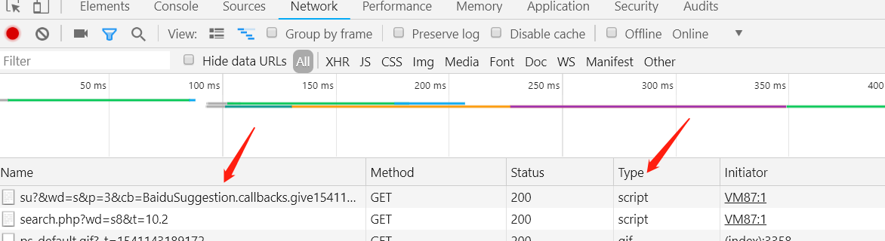
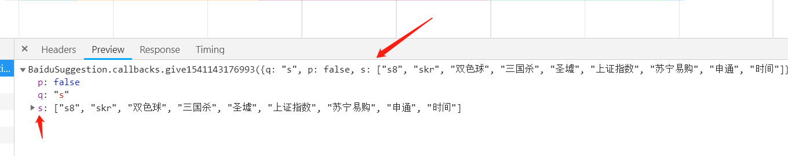

# 实现记录 [效果预览](http://htmlpreview.github.io/?https://github.com/rujinshi/Demo_Front/blob/master/2.%E4%BB%BF%E7%99%BE%E5%BA%A6%E6%90%9C%E7%B4%A2%E6%A1%86/index.html)

## 实现原理

向输入框动态输入时关键词，将当前关键词作为问号参数后面的值，因为要跨域使用百度的接口，所以通过 JSONP 跨域创建 Ajax 请求。回调函数处理返回值。

尝试研究了一下百度的接口，发现原生的 XHR 接口参数有点复杂(百度应该是考虑了很多情况)。

找了一个 2345 导航，在输入框随便输入一个字母 s，打开 Network,发现它也是向百度的一个[地址](https://www.baidu.com/su?&wd=s&p=3&cb=BaiduSuggestion.callbacks.give1541143176993&t=1541143189081)发送了请求，其中问号后面的‘&wd=s’发送的就是此关键词，'&cb='应该就是回调处理函数，并且它的 Type 也是 script，2345 导航应该也是通过 JSONP 向百度获取数据的。


```js
var script = document.createElement("script");
script.src =
  "https://www.baidu.com/su?&wd=" +
  encodeURI(this.value.trim()) +
  "&p=3&cb=handleSuggestion";
document.body.appendChild(script);
```

点开那条请求，果然在里面看到了返回的数据。返回的结果是以一个对象的形式返回的。q 对应着检索关键词，s 对应着返回的结果(数组形式)


后续只需要动态创建 li 标签，设置里面的内容，以及注意其他细节问题。

1.使用 flex 布局实现搜索框的水平垂直居中，鼠标悬停时，搜索按钮添加了一个 box-shadow。

坑 设置完 flex 属性之后发现并没有水平垂直居中，当时设置了父盒子 height:100%,发现如果将 height 设置成具体值就可以实现居中。怀疑是设置了%高度无效，查了一下，高度百分比是相对于父盒子的，也就是 body。默认 html 和 body 是没有设置 height 的。另外，在布局中对于没有设置宽高的块状盒子，宽度默认是 100%的，高度是由里面的内容自然撑开的。

2.先获取常用的 DOM 节点，避免后续频繁查询操作 DOM。

3.为了避免在输入过程中频繁发送请求(如果打字速度快),对请求函数做了函数节流，调了一下间隔 130ms 差不多正好，时间再长就会有卡顿的感觉。使用了 ES6 中的箭头函数避免了 setTimeout 中 this 指向的问题。

4.在回调函数中：

- 每一次执行时首先要清除建议框里的内容，不然上一次的结果还会存在建议框里！截取了结果中的前五个(如果把所有结果都展示出来感觉有点丑..百度官方是展示前四个搜索建议)
- 结果处理完毕后，执行自执行匿名函数，删除创建的 script 标签

5 点击 li 标签或者点击"搜索一下"跳转百度进行搜索时，利用事件冒泡原理，进行事件委托。这里没有考虑兼容性问题：

```js
e = e || window.event;
target = e.target || e.srcElement;
```

6.除了点击事件，键盘事件--回车键以及上下键都是进行事件委托进行注册的。

最终能够实现键盘上下键鼠标选择，点击“搜索一下”或回车键实现跳转搜索。

---

补充晚上看一点 JS 性能优化的资料：

1.由于 Id 是唯一的，因此相比 className 或者 tagName，根据 Id 查找是相对快的，但是上述获取到的结果都是 HTML 集合,该集合始终与底层文档保持连接，效率低下。然而 querySelector 以及 querySelectorAll，得到的是一个 NodeList，它是一个类数组对象，不会带来 HTML 集合的问题,但是要考虑兼容性问题。另外，要避免反复查询，可以将 DOM 结点保存到变量中去。

2.尽可能少的去改变 DOM 包括添加，修改，删除。改变 DOM 就会引起浏览器渲染。所以之前动态创建 li 标签并插入到 DOM 中的方式性能是不高的，由于要插入的 li 标签个数不多可能无法体会，如果 li 标签多了就会有卡顿。

```js
for (let i = 0; i < result.length; i++) {
  // 动态创建li标签;
  var liObj = document.createElement("li");
  liObj.innerHTML = result[i];
  searchResult.appendChild(liObj);
}
```

所以改成 innerHTML 的形式：

```js
var str = "";
for (let i = 0; i < result.length; i++) {
  str += `<li>${result[i]}</li>`;
}
searchResult.innerHTML = str;
```
