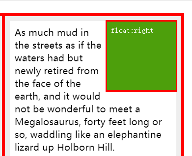
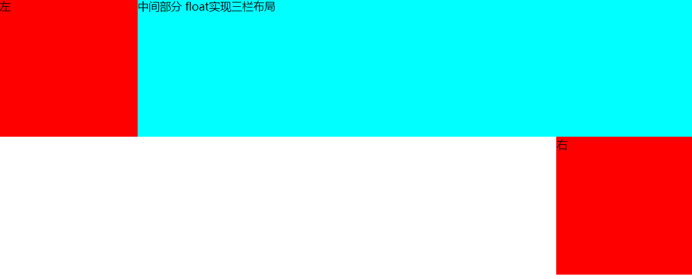

## 1.float 实现左右定宽 中间自适应布局

### 思路/原理：

左右各一个 div 分别左浮动和右浮动，给定宽度，中间盒子就能实现自适应了。

### 误区

1 当时在想为什么这样就可以了，浮动的元素是脱离文档流的，可以认为它是飘在中间的盒子上的，难道不会对中间 div 内容产生遮挡吗？

后来去[MDN](https://developer.mozilla.org/zh-CN/docs/CSS/float)查到了原因-----'最初，引入 float 属性是为了能让 web 开发人员实现简单的布局，包括在一列文本中浮动的图像，文字环绕在它的左边或右边。' 所以不会对中间 div 里的内容产生遮挡。
像下面这样：


2 当我按照左中右三个部分去排列时，发现最后右边的框子是会掉下来


===== 为什么？[MDN 是这么说的:](https://developer.mozilla.org/zh-CN/docs/CSS/float)当一个元素浮动之后，它会被移出正常的文档流，然后向左或者向右平移，一直平移直到碰到了所处的容器的边框，或者碰到另外一个浮动的元素。

由于此 demo 中间 div 是位于文档流中的元素，我把它放在第二个位置，所以它会优先于右边的 div 渲染。右边元素又有浮动的特性，所以它的相对垂直位置不会改变，右侧紧贴父盒子边框。

所以一定要将左右浮动的两个 div 写在前面，中间的 div 写在最后面就可以实现了

## 2.absolute 实现左右定宽 中间自适应布局

### 思路/原理

container 下的左中右三个 div 都设置绝对定位，左右 div 定宽,left:0,right:0 中间的 left 和 right 为左右 div 的宽度

由于三个子元素都是绝对定位，我们可以将 container 设置为相对定位。

## 3.flex 布局 实现左右定宽 中间自适应布局

### 思路/原理

将父盒子.container 的 display 设置为 flex，左右子元素定宽，中间 flex 设置为 1

flex 是 flex-grow、flex-shrink、flex-basis 的缩写，如果仅设置为一个无单位的正数，则表示为 flex-grow 的属性(表示元素的拉伸因子)。

## 4.table 布局

### 思路/原理

将整个结构设为一行三列。整个 table100%宽，左右两列定宽，中间自适应。父盒子设置 display:table;里面的子盒子设置 display:table-cell;

## 5.grid 实现三栏布局

### 思路/原理

```css
.container {
  display: grid;
  /* 每一行的高度 */
  grid-template-rows: 200px;
  /* 每一列的宽度 */
  grid-template-columns: 200px auto 200px;
}
```

## 6.flex 实现圣杯布局

## 7.float 实现圣杯布局

## 8.双飞翼布局
